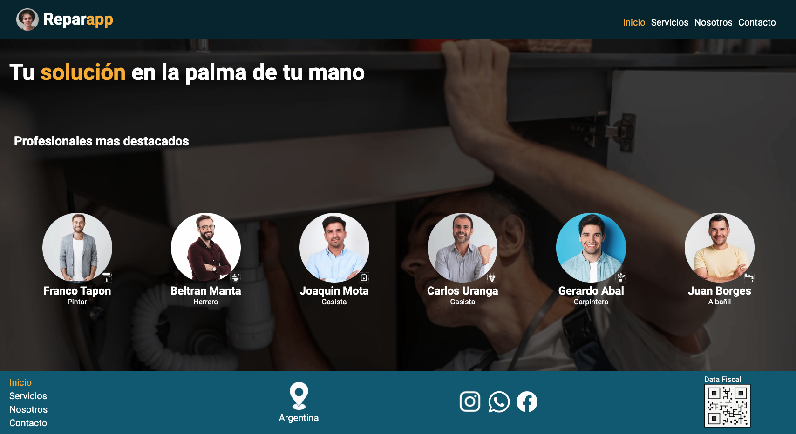

<h1>Bienvenidos a Reparapp </h1>

<h2> Curso Desarrollo Web / Comisión 39385 / Coderhouse </h2>

#### Tecnologías Usadas

- Figma
- HTML
- CSS
- SASS
- SEO
- GITHUB

<h3>Desarrollo del proyecto - Paso a Paso </h3>

**Primer paso**

El trabajo arranco desarrollando en Figma (link del trabajo) lo que debíamos desarrollar en codigo con la tecnología HTML. Desarrollamos las 3 vistas (desktop, tablet y mobile) ubicando los elementos en cada vista para lograr el sitio responsive.

**Segundo paso**

Una vez desarrollado el proyecto en Figma, comenzamos a escribirlo en HTML, logrando tener la estructura correspondiente con el correcto uso de las etiquetas sin aún colocar estilo alguno. Una vez armadas las 5 paginas solicitadas por el profesor y conectadas entre si para poder navegar libremente, empezamos a darle estilo con CSS, logrando lo que habíamos plasmado en Figma.

**Tercer paso**

Con CSS determinamos las fuentes (Roboto), colores, tamaños de fuentes, fotos de portada, y mas.

Todas las páginas son responsive, utilizando Flexbox y Grid, y una de ellas (la de contacto) tiene el formulario echo con Bootstrap, también responsive. 

**Cuarto paso**

Aprendimos a usar GIT, los comandos para navegar dentro de la terminal y para poder subir el proyecto al respositorio en GITHUB. Los mismos son:

- GIT INIT
- GIT STATUS
- GIT ADD .
- GIT COMMIT -M "Nombre del capitulo"
- GIT LOG
- GIT PUSH

Una vez el proyecto cargado en GITHUB llego el momento de SASS, instalamos NODE JS, luego aprendimos las distintas maneras de instalarlo. Restructuramos el SASS colocando las carpetas Base, Components, Layout  y Utilities y dentro de ellas los distintos links para luego transcribir todo el CSS que teniamos armado.

**Quinto paso**

Luego colocamos animaciones a los botones, navbar, colores, etc y terminando con SEO, agregando etiquetas "meta viewport, meta description, meta keywords y mas.